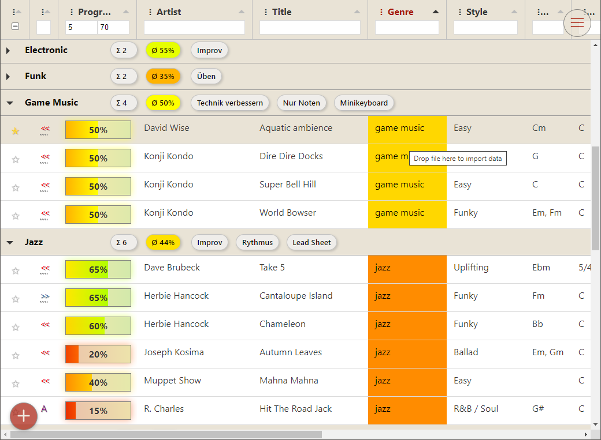

<a name="readme-top"></a>

# My song repertoire


## About the project

[](https://song-repo.web.app)

An [app](https://song-repo.web.app) for musicians to keep an overview of their personal song repertoire.

Do you occasionally forget which song you could play? Would you like to share your repertoire with friends? 
Or do you just want to keep track of your progress and know which song you could refresh? 
Then this app is right for you to keep an overview.

### Features
- Create personal song list
- Manage your learning progress
- Custom tags to note your features
- Search song data: genre, key, tempo, lyrics, tutorials
- Share or export list to CSV, XLSX, PDF, JSON
- Integrated blog with useful articels on how-to make music
- Public event calendar for Open Piano or Play Me I'm Yours

### Built With

* [![Svelte][Svelte.dev]][Svelte-url]
* [![Typescript][Typescript.dev]][Typescript-url]
* [![Tabulator][Tabulator.dev]][Tabulator-url]

### Hosting
[Firebase: deploy to another site](https://stackoverflow.com/questions/65461482/firebase-deploy-to-another-site)
```
firebase init

firebase target:apply hosting beta song-repo-beta
firebase target:apply hosting prod song-repo

firebase deploy --only hosting:beta
firebase deploy --only hosting:prod
```

<p align="right">(<a href="#readme-top">back to top</a>)</p>

## Getting Started

### Prerequisites

You should install [nodejs](https://nodejs.org) and [pnpm](https://pnpm.io). I'd recommend [Visual Studio Code](https://code.visualstudio.com) for developing.

### Installation

_Below is an example of how you can instruct your audience on installing and setting up your app. This template doesn't rely on any external dependencies or services._

1. Clone the repo
   ```sh
   git clone https://github.com/ortwic/song-repoe.git
   ```
2. Install NPM packages
   ```sh
   pnpm install
   ```
3. Start app in debug mode
   ```js
   pnpm dev
   ```

<p align="right">(<a href="#readme-top">back to top</a>)</p>

## Roadmap

See the [open issues](https://github.com/users/ortwic/projects/2/views/1) for a full list of proposed features (and known issues).

- [x] Add tabulator component
- [x] Firestore persistance
- [x] Auth with email/pwd or Google account
- [ ] CI/CD and unit tests
- [x] Song name suggestion API
- [x] Manage genres, artists, etc.
- [x] Share song list
- [x] Integrated blog
- [ ] Dark skin
- [ ] Kanban board view

<p align="right">(<a href="#readme-top">back to top</a>)</p>

## Contributing

Really? This project is very small yet. Contact me if you really desire...

## License

Distributed under the BSD 3-Clause License. See `LICENSE` for more information.

<p align="right">(<a href="#readme-top">back to top</a>)</p>

## Contact

Ortwin - [Portfolio](https://ortwic.github.io/) - ocsoft42@gmail.com

Project Link: [https://github.com/ortwic/song-repo](https://github.com/ortwic/song-repo)

<p align="right">(<a href="#readme-top">back to top</a>)</p>

## Acknowledgments

* [Choose an Open Source License](https://choosealicense.com)
* [GitHub Pages](https://pages.github.com)
* [Tabulator](https://tabulator.info)
* Images
  * [Boxicons](https://boxicons.com)
  * [SVG Repo](https://www.svgrepo.com/)
  * [Flaticon](https://www.flaticon.com/)
* HTML/CSS
  * [Malven's Flexbox Cheatsheet](https://flexbox.malven.co/)
  * [Malven's Grid Cheatsheet](https://grid.malven.co/)

<p align="right">(<a href="#readme-top">back to top</a>)</p>

[Svelte.dev]: https://img.shields.io/badge/Svelte-4A4A55?style=for-the-badge&logo=svelte&logoColor=FF3E00
[Svelte-url]: https://svelte.dev/
[Typescript.dev]: https://img.shields.io/badge/Typescript-3178c6?style=for-the-badge&logo=typescript&logoColor=FFFFFF
[Typescript-url]: https://www.typescriptlang.org/
[Tabulator.dev]: https://img.shields.io/badge/Tabulator-4A4A55?style=for-the-badge&logo=tabulator&logoColor=3FB449
[Tabulator-url]: https://www.tabulator.info/
